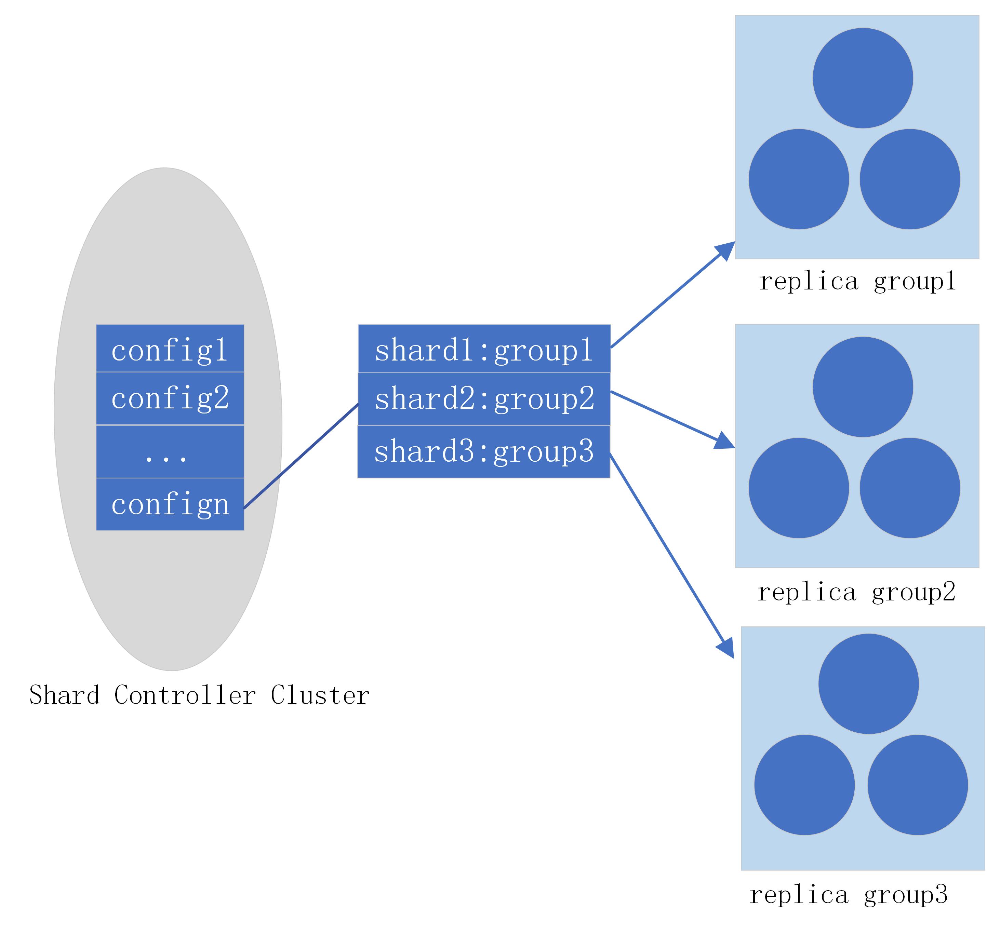

> 本文主要介绍Shard Controller实现负载均衡的策略，以及副本集之间迁移分片数据的策略。本文不会涉及详细代码，因此会省略亿点点的细节。具体的实现见[lzlaa/6.824: 2021 6.824 (github.com)](https://github.com/lzlaa/6.824)

# Sharded KV storage Serveice

这个实验是要完成一个具有分片功能的KV存储服务，为了提高系统的性能会将数据划分成不同的分片交由不同的副本集进行管理，这样客户端的请求会被路由到不同节点，从而提高整个系统的吞吐量。

整个系统被划分为两部分：

1. 提供存储服务的一组副本集，每个副本集由多个节点(shardKV)组成，节点之间通过Raft协议同步日志。
2. 分片控制器(shard controller)，管理分片与副本集的映射关系，当添加新的副本集或者是移除副本集后shard controller会调整映射关系，实现整个系统的负载均衡。

如下图所示为分片KV存储服务的架构图，Shard Controller 管理整个系统的配置信息，**每个配置信息(config)可以看作是分片与副本集的路由表**。每次系统的配置发生变更，如新增加一个副本集或是移除副本集，Shard Controller都会调整路由表并生成一个新的配置。

客户端的在发出请求之前需要先查询Shard Controller获取最新的配置信息，然后访问路由表查询分片所对应的副本集。每个副本集也需要主动查询Shard Controller获取最新的配置，避免处理其他副本集的分片。



## Shard Controller

为了保证Shard Controller的高可用，实际上服务构建于多个实现了Raft协议的节点组成的集群，类似于lab3的分布式KV存储服务（同样需要提供线性一致性的接口，方法相同）。Shard Controller将存储集群的配置变更情况添加到Raft的日志中，同步到Shard Controller集群中的所有节点，**当日志被提交后**每一个Shard Controller会执行**确定性的负载均衡算法**保证所有的Controller都拥有相同的配置信息(`config`数组)。

本lab限制了总的分片数目，随着副本集组数目的变化每个副本集管理的分片数应该尽可能均匀(每个副本集的分片数相差不超过1)，且要保证迁移尽可能少的分片。**为了满足上述要求，Shard Controller通过维护一个大顶堆和一个小顶堆记录每个副本集管理的分片数目，并能够在系统配置变更时快速平衡每个副本集的分片数目**。具体方法就是：

1. 当新增一个副本集后，计算该副本集应该获得的分片数，然后遍历大顶堆每次从堆顶副本集迁移一个分片，直到新副本集获得足够的分片。
2. 当移除一个副本集后，计算每个副本集应该获得的分片数，然后遍历小顶堆每次给堆顶副本集分配一个分片，直到被移除副本集的分片分配完毕。

该负载均衡算法简单易于实现，具体代码就不给了。

## ShardKV

一个副本集就是由多个运行Raft协议的ShardKV节点组成的，ShardKV除了要提供具有线性一致性的Put、Append、Get接口(同lab3)外，还需要与Shard Controller交互获取最新的配置信息，并在配置变更时完成分片数据的迁移。接下来分别介绍ShardKV如何与Shard Controller交互以及如何安全地迁移分片数据。

当系统添加或移除副本集时Shard Controller就会生成一个新的`config`记录路由信息，ShardKV需要与Shard Controller交互获取最新的`config`。更新副本集的`config`有两种方式：push、pull，

+ push：就是由Shard Controller主动将最新的`config`发送到每个副本集中。
+ Pull：就是由副本集主动请求Shard Controller最新的`config`。

本文选用的是**push**的方式，因为相较于pull，push存在如下问题：

1. Shard Controller难以确定每个副本集的leader，就需要为所有的ShardKV推送config，这会增大Shard Controller的流量。
2. 由于网络的不稳定性，推送的数据包可能丢失在网络中，因此Shard Controller需要额外的确认机制。
3. 不同的副本集可能处于不同的阶段，因此所需要的config也不一致，而追踪每个副本集的状态会增加Shard Controller的复杂度。

如果采用的是pull的方式，只需要副本集中的leader节点主动拉取需要的`config`数据即可，有效的避免了上述的问题。

接下来的问题是ShardKV什么时候需要拉取`config`？这里的原则是必须等到上一个`config`应用成功，才需要拉取下一个`config`。**`config`应用成功是指副本集的多数节点都应用了该`config`，并且`config`中指定的分片数据也已经迁移完成。**

为了解决上述问题，本文增加了一个`reconfig`请求，当leader获取到一个新的`config`后将其封装为`reconfig`请求添加到Raft的日志中，当其被提交且执行之后就意味着多数节点应用了该`config`。

本文设计了一个数据结构`PullTasks`记录应用了config之后需要拉取的分片数据信息：

```go
// 记录待执行的拉取分片数据任务；
// 在reconfig之后，将需要拉取的任务记录在TaskStruck结构中；
// 当前config的拉取任务未完成之前，不能再次执行reconfig；
// 当客户端的数据操作请求到达时，需要判断被操作数据是否在migrating中(未完成数据迁移)，
// 如果在就不能执行操作。
//
type PullTasks struct {
	mu     *sync.RWMutex
	tasks  map[int]TaskStruct
	migrating map[int]bool 		// 正在数据迁移的shards
}

// 从ToGID拉取分片数据的任务
type TaskStruct struct {
	Cfgnum    int				// 当前副本集生效的config number
	ToGID     int				// for debug，发起任务的副本集ID
	ToServers []string	// for debug，发起任务的副本集节点名称
	Shards    []int			// 拉取的分片哈希
}
```

+ `tasks`记录了副本集需要从其它副本集拉取分片数据的任务
+ `migrating`记录了还未完成的分片，所有未在`migrating`中的分片数据操作都可以被执行。**因此ShardKV可以在迁移数据的同时，执行部分客户端的请求。**

基于上述分析我们可以实现一个`poll`协程的框架，poll协程是在`ShardKV`启动时就执行的会周期性地从Shard Controller拉取最新的`config`，或者是从其它的副本集中拉取分片数据合并到数据库。

```go
// 以下代码只是一个框架

// 定时更新自己的config
// 从需要向其它的备份组拉取数据
// 将新的config和拉取到的数据添加到Raft的日志并等待其同步到其他节点后才执行。
func (kv *ShardKV) poll() {

   for {
      time.Sleep(time.Millisecond * 100)	// 每隔100ms拉取一次config
			
      if kv.pullTasks.Len() == 0 {	// pullTasks为空

         // 由于Query会超时，所以这里加上超时控制。
         var cfg shardctrler.Config
         originCfgNum := int(atomic.LoadInt64((*int64)(unsafe.Pointer(&kv.config.Num))))
         cfg = kv.mck.Query(originCfgNum + 1)	// 拉取下一个config
         if cfg.Num == originCfgNum {					// 没有最新的config
            continue
         }

         reconfigArg := ReConfigArgs{Config: cfg}
         op := Op{
            ServerID: kv.me,
            Kind:     "ReConfig",
            Value:    reconfigArg,
            Cfgnum:   cfg.Num,

            // 因此可以将备份组的gid，以及新config的编号作为唯一标识符。
            // Identifier中ClerkID的最高位为1，标识该请求来自于server而不是Clerk。
            ID: Identifier{
               ClerkID: 1<<62 | kv.gid,
               Seq:     cfg.Num,
            },
         }
         // 将reconfig请求添加到Raft的日志中并等待被执行
          ...
      } else {	// pullTasks不为空，从其他的副本集中拉取分片数据
         tasks := kv.pullTasks.Export()

         // 执行拉取协程，从gid标识的备份组拉取ts.Shards对应的数据
         for gid, taskStruct := range tasks {
            go func(gid int, ts TaskStruct) {
               pullargs := PullArgs{
                  Shards:  ts.Shards,
                  Cfgnum:  ts.Cfgnum,
                  FromGID: kv.gid,
               }
               
               // 发送拉取分片数据的RPC调用
               reply := kv.pull(&pullargs, ts.ToServers)
               if reply == nil {
                  return
               }

               mergeArgs := MergeArgs{	// 合并分片数据的请求
                  FromGID:    gid,
                  DB:         reply.DB,
                  SeqTable:   reply.SeqTable,
                  ReplyTable: reply.ReplyTable,
               }

               op := Op{
                  ServerID: kv.me,
                  Kind:     "Merge",
                  Value:    mergeArgs,
                  Cfgnum:   ts.Cfgnum,

                  // 因此可以将被拉取备份组的gid，以及新config的编号作为唯一标识符。
                  // Identifier中ClerkID的最高位为1，标识该请求来自于server而不是Clerk。
                  ID: Identifier{
                     ClerkID: 1<<62 | gid,
                     Seq:     ts.Cfgnum,
                  },
               }

               // 将合并请求添加到Raft的日志中，等待分片数据合并请求被执行
               ...

            }(gid, taskStruct)
         }
      }
   }
}
```

需要注意的是当一个副本集接收到`pull`请求后，同样需要将该请求封装为`PullArgs`添加到Raft的日志中，直到该日志被提交之后才能真正的从自己的数据库中**删除请求中的分片数据**并响应RPC请求；同样的副本集在收到分片数据后，也需要将数据封装为`MergeArgs`添加到Raft的日志中，直到该日志被提交之后才能真正合并到数据库，并冲`PullTasks`中删除对应的`TaskStruct`；这样才能保证ShardKV之间数据库的一致性。