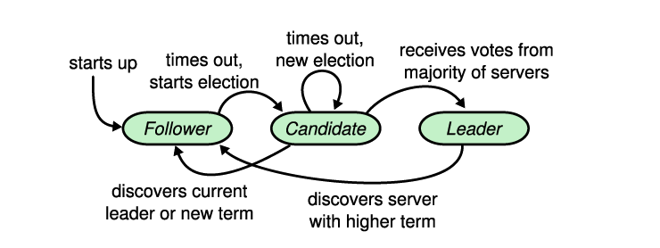
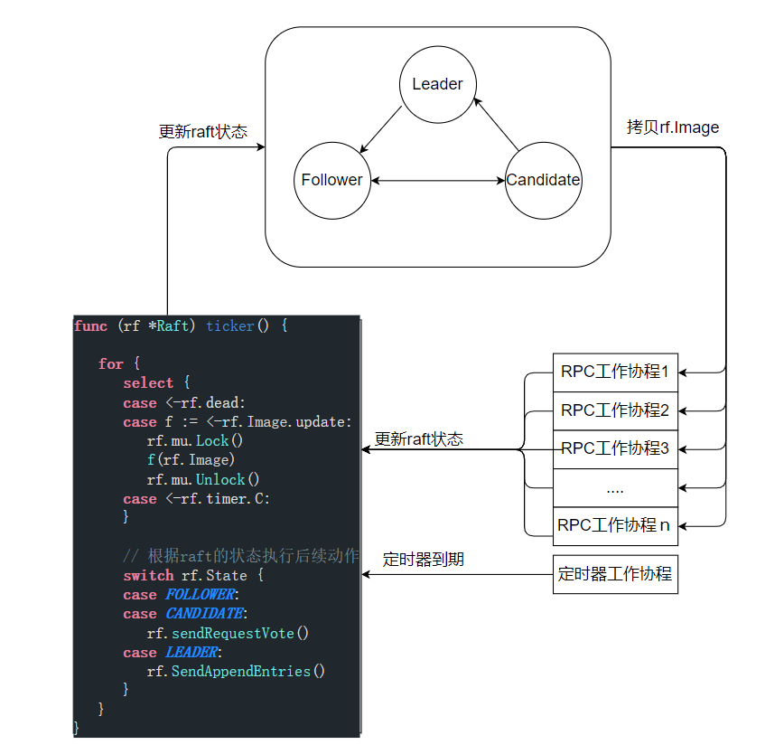

> 本文只给出了实现basic raft的设计策略以及实现架构，具体的实现见[lzlaa/6.824: 2021 6.824 (github.com)](https://github.com/lzlaa/6.824)。

# basic raft设计概要

为了降低raft实现的复杂性以及提高系统的可维护性，本文基于设计的数据结构Image采用了两种设计策略：

+ 借鉴CAS的思想，在工作协程被创建时缓存raft当前的状态镜像(记录在`Image`实例中)，后续根据镜像处理RPC的请求。当要更新raft状态、或响应rpc之前需要先判断raft状态镜像是否仍有效，如果有效才执行后续操作。

  通过记录raft的状态镜像避免了在整个RPC请求处理的过程中加锁，只需要在获取镜像以及提交更新的时候加锁即可。由于拷贝Image实例是只有读操作，因此可以在拷贝Image实例是申请读锁，这样可以**提高系统的并发度**。

+ 借助管道，由`ticker`协程统一执行所有的状态更新操作。所有的工作协程会将对于raft的状态更新操作传递给ticker协程，ticker协程更新了raft的状态后还会通知其余的工作协程：其所持有的`Image`实例已失效，**工作协程可以立即退出**。

具有这两个设计策略，能够实现一个易于理解、易于维护和高性能的raft。

## 数据结构Image

```go
type Image struct {
	// 向ticker协程传递状态更新函数
	update chan func(i *Image)
	did    chan signal
	done 	 chan signal

    // raft的状态
	CurrentTerm int
	State       int
	VotedFor    int
    
    // Image实例所属的raft
	*Raft
}
```

`Image` 记录某一时刻 raft 的状态；每个工作协程被创建后都会获得当前时刻`raft.Image`的**值拷贝**，后续操作无需访问raft而是根据拷贝的`Image`实例处理RPC请求。除了记录raft的状态变量之外，Image中还包含三个管道：

+ `update`，是工作协程用来向`ticker`协程传递raft状态更新函数。
+ `did`，是`ticker`协程用来通知工作协程状态更新函数执行完成的。
+ `done`，是`ticker`协程用来通知所有监听该管道的工作协程：其持有的Image实例已失效。

所有的`Image`实例共享相同的`update`和`did`，而同一个`raft.Image`(每次raft的状态更新之后，`raft.Image`也会更新)的所有值拷贝共享同一个`done`；工作协程要想向ticker协程传递状态跟新函数，必须判断`Image.done`是否被关闭，如果被关闭则说明该Image实例已经失效；如果没有被关闭，就将状态更新函数传递到`update`管道中，并等待`did`中`ticker`协程发送的信号。由于`update`是无缓冲管道，一次只会有一个工作协程成功向其传递状态更新函数，也就只有一个工作协程需要监听did管道，因此所有的Image实例共享相同的`update`和`did`也是安全的。

`Image` 有如下两个方法：

+ `Done() bool`：如果当前 Image 实例已经失效，如果已失效表明 raft 的状态已经发生改变则返回`true`，否则返回`false`。

+ `Update(act func(i *Image)) bool`：工作协程调用`Update`函数向与自己绑定的`Image`实例的`update` 管道传递更新 raft 状态的函数 `act`；在发送之前需要先检查当前的`Image`示例是否已失效，则返回`false`；否则返回`true`。

  **当调用`Done`或者`Update`返回`false`，就表示raft的状态已经改变，当前的`Image`实例已经失效，此时工作协程应该立即退出无需继续处理当前的RPC请求。**

```go
func (image Image) Update(act func(i *Image)) bool {

	// 判断image是否早已失效，1
	select {
	case <-image.done:
		return false
	default:
		break
	}

	select {
		// 判断image是否早已失效，2
	case <-image.done:
		return false
		
		// 发送更新raft状态的函数，通知ticker协程更新raft的状态
	case image.update <- act: 
		<-image.did	 // 发送成功后等待act函数执行完毕后返回
		return true
	}
}

// 工作协程通过判断done是否关闭，确定image是否已失效
func (image Image) Done() bool {
	select {
	case <-image.done: 
		return true
	default:
		return false
	}
}
```

在`Update`函数中有两个检查`image.done`是否关闭的逻辑，是因为`Update`函数需要同时监听两个管道，如果两个管道同时有数据流动那么`select`会随机选择一个分支执行，因此如果只有第二个`select`代码块，可能会发生意想不到的bug。

## 系统架构

上面描述的数据结构Image可以传递RPC请求事件，如RequestVote RPC以及AppendEntry RPC，然而整个raft系统中还存在着其他的事件需要处理。



上图描述了raft状态转换图，**可能**导致raft状态转换的事件主要有

1. 计时器超时，本文通过`timer time.Timer`对象来模拟定时器。
2. 接收到Leader的的AE RPC(Append Entry RPC)请求，处理返回的AE RPC响应
3. 接收到Candidate的RV RPC(Request Vote RPC)请求，处理返回的RV RPC响应
4. raft 宕机了，通过关闭`rf.dead`模拟节点故障。

为了能够处理所有的事件并更新raft的状态，`ticker`协程首先要监听`timer.C`管道来确定是否发生了计时器超时事件；监听`dead`管道来确定raft是否发生了宕机；还需要监听`Image.update`管道，来执行RequeVote RPC请求与响应协程以及AppendEntry RPC请求与响应协程发送来的状态更新函数。

如下图所示为raft系统的架构图，ticker协程是整个系统的引擎驱动raft的状态变化。



基于该架构，整个raft的实现逻辑就变得清晰起来了：

1. RPC请求处理函数首先拷贝`rf.Image`，然后根据该拷贝处理RPC请求。
2. 工作协程通过`Image.update`向`ticker`协程传递状态更新函数，驱动raft的状态变化。
3. 工作协程在响应RPC之前要判断其所持有的`Image`实例是有有效，如果无效则无需响应该RPC。
4. ticker协程通过监听`rf.timer.C`处理定时器超时事件(更新term、发起选举、发送心跳等)，监听rf.dead处理节点故障事件(通知所有的协程退出)。

