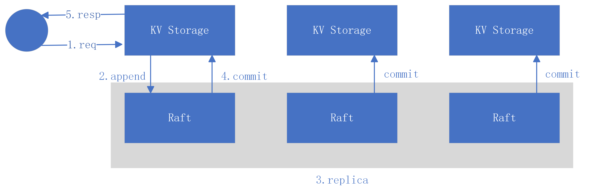
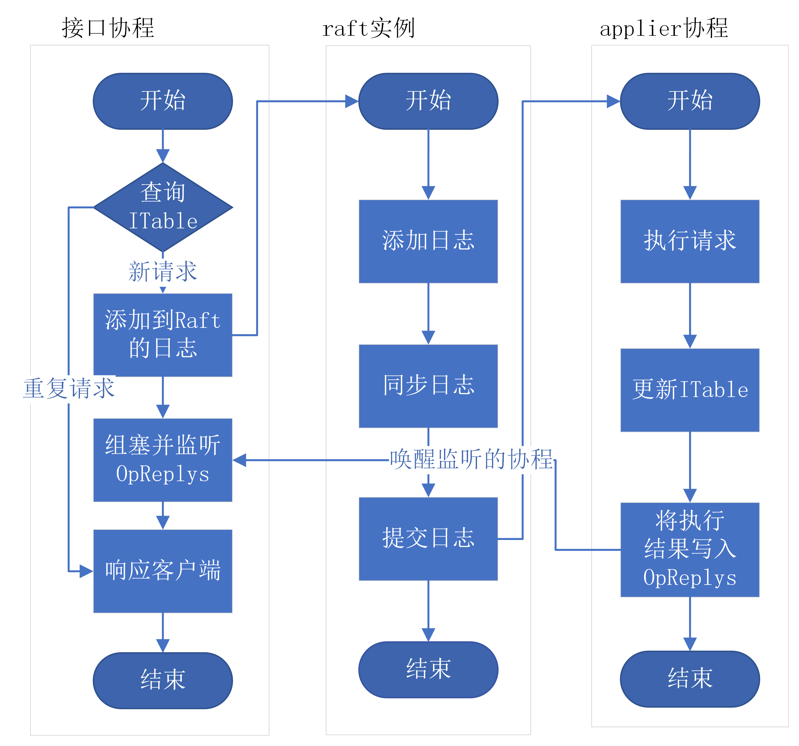

> 本文不涉及完整的代码实现，只给出了为了保证线性一致性而设计的主要数据结构。具体的实现见[lzlaa/6.824: 2021 6.824 (github.com)](https://github.com/lzlaa/6.824)

# KV storage Service

在这个lab，需要基于lab2实现的raft代码库构建一个高可用、提供强一致性接口的KV存储服务。整个KV存储服务就是一个复制状态机，多个服务节点通过raft协议进行状态的同步。但是raft无法感知到上层服务的状态，因此服务层必须设计合适的数据结构来提供强一致性保证。

存储服务支持三种接口：`Put(key, value)`, `Append(key, arg)`, and `Get(key)`。存储层是一个简单的键值对数据库，在代码中就是`map[string][]string`。

KV存储服务必须保证接口的强一致性(线性一致性)保证，即对于所有的客户端整个系统应该表现得像只有一个节点。具体的要满足如下的性质：

1. 请求必须是瞬间完成的（或者原子地）
2. 任何请求都必须在其发起调用，收到响应之间被执行。
3. 一旦某个请求执行之后，**所有**后续的请求都可以观测被操作对象最新的值（如果是写操作的话）。

## 系统架构

整个服务的架构如下图所示：



首先客户端节点将请求发送到KV存储服务的主节点，然后存储服务将请求转发到底层的Raft实例，Raft实例之间通过Raft协议拷贝日志，当半数以上节点完成了日志拷贝之后Raft实例将日志提交到存储服务，最后存储服务执行封装在日志中的请求操作并响应客户端。

## 线性一致性保证

Raft保证所有节点的日志提交顺序都是线性且一致的，因此存储服务无需担心并发请求的问题。实际上存储服务只需要保证客户端的请求，至多被执行一次即可。实验的测试环境或模拟不稳定的网络环境：

1. 客户端的响应丢失在网络中，客户端会超时重传请求
2. 客户端的请求丢失在网络中，客户端会超时重传该请求
3. 客户端的请求被Raft丢弃，客户端会超时重传该请求

**为了解决该问题客户端必须保证相同的请求有相同的标识符，服务端必须保证相同标识符的请求最多被执行一次。**

### Clerk数据结构

```go
type Clerk struct {
   servers []*labrpc.ClientEnd
   // You will have to modify this struct.
   leaderID int // 目前所知的leader ID
   ClerkID  int
   OpSeq    int // clerk下一个Op使用的sequence number
}
```

客户端通过`OpSeq`作为请求的标识符，服务端通过`{ClerkID, OpSeq}`作为请求的标识符。

### KVServer数据结构

```go
type KVServer struct {
   mu      sync.Mutex
   me      int
   rf      *raft.Raft
   applyCh chan raft.ApplyMsg
   dead    int32 // set by Kill()

   maxraftstate int

   // Your definitions here.
   OpReplys 
   ITable   
   Database // 数据库；需要持久化保存
}
```

`ITable`记录客户端下一个请求的`OpSeq`，如果遇到请求的`OpSeq`小于记录中的`OpSeq`，说明该请求是一个重传请求，则直接返回其执行结果；

`OpReplys`记录服务端正在处理的请求，当一个客户端请求第一次到达服务端时会监听`OpReplys`，等待该请求的执行结果。

服务端的处理流程如下图所示：



接口协程是服务端处理客户端请求的工作协程，`applier`协程监听`kv.applyCh`来处理Raft提交的日志。

#### ITable

```go
type ITable struct {
	mu         *sync.RWMutex
	SeqTable   map[int]int         // 记录每一个clerk的待提交的Op Sequence number
	ReplyTable map[int]interface{} // 记录每一个clerk的上一个Op的执行结果，以便等待同一个op的clerk协程能够立即返回
}

// 更新clerkID对应clerk的下一个Op标识符
func (itable ITable) UpdateIdentifier(clerkID int, seq int, reply interface{}) {
	itable.mu.Lock()
	defer itable.mu.Unlock()

	itable.SeqTable[clerkID] = seq
	itable.ReplyTable[clerkID] = reply
}

// 如果i标识的Op已经被执行过了，Executed返回true，以及缓存的结果。
func (itable ITable) Executed(i Identifier) (executed bool, reply interface{}) {
	itable.mu.RLock()
	defer itable.mu.RUnlock()

	return i.Seq < itable.SeqTable[i.ClerkID], itable.ReplyTable[i.ClerkID]
}
```

`ITable`通过一个哈希表记录各个客户端待提交`OpSeq`：键是客户端的`ClerkID`，值是该客户端下一个请求的`OpSeq`。如果请求的`OpSeq`小于`SeqTable`的`OpSeq`则表明该请求是一个重传请求，则会从`ReplyTable`中取出执行结果并立即返回。

为什么可以直接从`ReplyTable`直接去出结果并返回？这是因为单个客户端不支持并发请求，即服务端如果接受到了重复的请求，那一定是客户端的最后一个请求。

另一个问题是`ITable`必须被持久化，因为服务节点故障重启之后必须仍能够辨别重复的客户端请求，因此KV存储服务在拍摄快照时必须包含`ITable`。

#### OpReplays

最后一个需要解决的问题是，如何在执行了客户端请求后能够及时地、安全地通知客户端返回。为此设计了`OpReplys`，`OpReplys`最主要的数据结构式`Index`与`SignalWithOpReply`的映射表。其中`Index`表示Raft提交的日志索引，`SignalWithOpReply`中最重要的结构是传递`signal`的管道。

每当客户端向Raft提交了请求之后，会获得该请求所对应的日志索引，然后客户端就会调用`OpReplys.WaitAndMatch(index, reqOp)`组塞在`OpReplys.table[index].s`上。每当`applier`协程执行完一个日志条目后就执行`OpReplys.SetAndBroadcast(i Index, op Op, re interface{})`通知等待的客户端返回。可能存在多个客户端监听同一个`signal`管道，这是因为Raft因为leadership的改变会丢失部分日志条目，所以会有客户端请求共享同一个日志索引。因此客户端拿到`SignalWithOpReply`后会判断是否是自己的请求，如果是才会获取对应的响应。

```go
type signal struct{}
type Index int

// OpReplays记录server提交给raft的op及其reply，所有的客户端在向server发送op后
// 阻塞在与该op绑定的channel上，server在执行完op之后通过关闭channel唤醒阻塞的clerk协程。
type OpReplys struct {
	// 如果table[index] != nil，说明存在clerk在等待index处的op
	table map[Index]*SignalWithOpReply
	mu    *sync.Mutex
	done  chan signal
}

// 记录每个Op，及其执行结果
// 但server执行完Op之后，关闭s以通知等待当前Op的Client
type SignalWithOpReply struct {
	s chan signal
	OpReply
}

// 阻塞在i处的Op对应的signal channel上，并在被唤醒后获取到Op以及对应的Result
// 当Op被执行之后applier协程通过关闭该signal channel通知阻塞的工作协程
// 如果调用协程是第一个调用者，首先初始化该signal
func (or OpReplys) Wait(i Index) *SignalWithOpReply {
	or.mu.Lock()
	ret, ok := or.table[i]
	if ok == false {
		or.table[i] = &SignalWithOpReply{
			s: make(chan signal),
		}
		ret = or.table[i]
	}
	or.mu.Unlock()
	select {
	case <-ret.s: // Op处理完毕
	case <-or.done: // Server宕机
	}
	return ret
}

// clerk协程等待reqOp的完成。
// 如果Err不为nil表明发生了leadership的转变。
// 因为存在raft leadership的转变，多个clerk可能会等待同一个index的op；当server执行完
// index对应的op后，会通知所有等待的clerk协程；clerk协程会根据result.op == reqOp判断
// 完成的op是不是自己提交的op；如果不是就表明发生了leadership的转变。
//
func (or OpReplys) WaitAndMatch(index int, reqOp Op) (interface{}, Err) {

	result := or.Wait(Index(index))
	resOp := result.op // raft所提交日志中的ApplyMsg

	// leadership 发生变更，或者原先提交的请求被覆盖时index处的 resOp != reqOp
	if !reflect.DeepEqual(resOp, reqOp) {
		return nil, ErrWrongLeader
	}
	or.Delete(Index(index)) // 为了节约内存及时删除缓存
	return result.reply, ""
}

// server 调用SetAndBroadcast唤醒所有等待i对应Op的工作协程(clerk)。
// 如果目前还没有clerk等待该Op，则直接返回；
// 如果存在clerk会等待该op的完成，就closer(ret.s)告知等待的clerk，该op已经完成
func (or OpReplys) SetAndBroadcast(i Index, op Op, re interface{}) {
	or.mu.Lock()
	defer or.mu.Unlock()

	ret, ok := or.table[i]
	if !ok { // 没有等待该Op的工作协程，直接返回
		return
	}

	ret.op = op
	ret.reply = re // 设置op的执行结果
	close(ret.s)   // 唤醒等待协程
}
```

